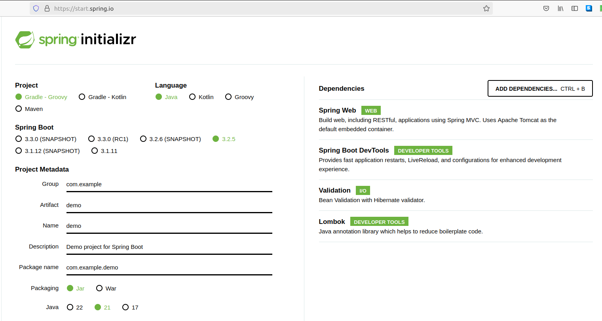

# Lego Flowers Lib

This repository containts an example web app for renting lego flowers.

## Tech-Stack

* Backend: Java Spring Boot
* Frontend: vue.js
* DB: Postgres SQL

## Development

### Backend

1. Initialize the backend with the [spring initializr webtool](https://start.spring.io/).

You can use the tool to configure the project as desired and let it generate the initial project setup.
